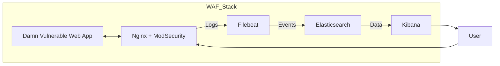

# Техническое руководство: Настройка системы защиты веб-приложений с использованием WAF

**Цель проекта:**  
Обеспечить защиту уязвимого веб-приложения DVWA с помощью WAF (ModSecurity), организовать мониторинг через Elastic Stack и провести сравнительный анализ производительности.

---

## Архитектура системы


*Рисунок 1. Взаимодействие компонентов системы*

---

## Этапы работы

1. **Развертывание уязвимого веб-приложения DVWA**  
2. **Настройка Web Application Firewall (ModSecurity)**  
3. **Настройка мониторинга с использованием Kibana и Elastic Stack**  
4. **Анализ производительности до и после внедрения WAF**

---

## 1. Развертывание DVWA

```yaml
services:
  db:
    image: mariadb:10.5
    environment:
      MYSQL_ROOT_PASSWORD: password
      MYSQL_DATABASE: dvwa
      MYSQL_USER: dvwa
      MYSQL_PASSWORD: password
    volumes:
      - db-data:/var/lib/mysql
    networks:
      - app

  dvwa:
    image: vulnerables/web-dvwa
    depends_on: [db]
    environment:
      DB_HOST: db
      DB_USER: dvwa
      DB_PASSWORD: password
      DB_DATABASE: dvwa
    expose: ["80"]
    networks:
      - app

volumes:
  db-data:
```

**Проблемы и решения:**

| Проблема                                   | Решение                                                           |
|--------------------------------------------|-------------------------------------------------------------------|
| Неправильные пути в Dockerfile или Compose | Проверить и скорректировать пути `COPY`, `build:`                |
| Отсутствие PHP-зависимостей                | Добавить `php-mysqli`, `php-xml` в образ DVWA                     |
| Неочищенный PID-файл Apache                | Добавить `rm /var/run/apache2/*.pid` в ENTRYPOINT перед запуском Apache |

---

## 2. Настройка WAF (ModSecurity)

**Dockerfile для nginx+ModSecurity:**
```dockerfile
FROM debian:bullseye

RUN apt-get update && apt-get install -y     nginx git build-essential libxml2-dev zlib1g-dev apache2-dev pkgconf

# Установка ModSecurity
RUN git clone --depth 1 -b v3/master https://github.com/SpiderLabs/ModSecurity     && cd ModSecurity && ./build.sh && ./configure && make && make install

# Модуль для nginx
RUN git clone --depth 1 https://github.com/SpiderLabs/ModSecurity-nginx     && cd /usr/local/src && wget http://nginx.org/download/nginx-1.24.0.tar.gz     && tar zxvf nginx-1.24.0.tar.gz && cd nginx-1.24.0     && ./configure --with-compat --add-dynamic-module=../ModSecurity-nginx     && make modules && cp objs/ngx_http_modsecurity_module.so /etc/nginx/modules/

COPY nginx.conf /etc/nginx/nginx.conf
COPY modsec.conf /etc/modsecurity/modsec.conf

EXPOSE 80
CMD ["nginx","-g","daemon off;"]
```

**nginx.conf:**
```nginx
load_module modules/ngx_http_modsecurity_module.so;

http {
  modsecurity on;
  modsecurity_rules_file /etc/modsecurity/modsec.conf;

  server {
    listen 80;
    location / {
      proxy_pass http://dvwa:80;
    }
  }
}
```

**modsec.conf:**
```apache
SecRuleEngine On
SecRequestBodyAccess On
SecAuditEngine RelevantOnly
SecAuditLog /var/log/modsec/audit.log

SecRule ARGS "<script" "id:1234,phase:2,deny,status:403,msg:'XSS Detected'"
```

**Проблемы и решения:**

| Проблема                               | Решение                                                       |
|----------------------------------------|---------------------------------------------------------------|
| Ошибки конфигурации Nginx/ModSecurity  | Проверить `nginx -t`, корректность пути `modsecurity_rules_file` |
| Неправильные права файлов (`modsec.conf`) | `chown root:root modsec.conf && chmod 0644 modsec.conf`       |
| Остатки старых контейнеров             | `docker rm -f nginx-modsec dvwa`                              |

---

## 3. Настройка мониторинга (Elastic Stack)

**filebeat.yml:**
```yaml
filebeat.inputs:
- type: log
  enabled: true
  paths:
    - /var/log/modsec/audit.log
  fields:
    service.name: modsecurity
  multiline.pattern: '^--[0-9a-f]{8}--$'
  multiline.match: after
  fields_under_root: true

output.elasticsearch:
  hosts: ["elasticsearch:9200"]

setup.kibana:
  host: "kibana:5601"

setup.ilm.overwrite: true
```

**docker-compose.yml (часть для Filebeat):**
```yaml
services:
  filebeat:
    image: docker.elastic.co/beats/filebeat:7.17.14
    user: root
    volumes:
      - ./filebeat/filebeat.yml:/usr/share/filebeat/filebeat.yml:ro
      - ./modsec/var/log/modsec:/var/log/modsec:ro
    depends_on: [elasticsearch]
    networks: [elk]
```

**Проблемы и решения:**

| Проблема                          | Решение                                                            |
|-----------------------------------|--------------------------------------------------------------------|
| Ошибка Filebeat маппинга          | Использовать `fields.service.name` вместо `fields.service`         |
| Нет индексов в Elasticsearch      | Проверить логи Filebeat (`docker logs filebeat`) и проверку монтирования томов |
| Проблемы DNS в контейнере         | Переключиться на Filestream input или использовать локальный Python-скрипт |

---

## 4. Анализ производительности

**Скрипт `load_test.py`:**
```python
import threading, time, urllib.request

URL = "http://localhost:8080/index.php"
NUM_REQUESTS = 1000
CONCURRENCY = 50

success = 0
fail = 0
lock = threading.Lock()

def worker():
    global success, fail
    try:
        with urllib.request.urlopen(URL, timeout=10) as r:
            with lock:
                success += (r.status == 200)
    except:
        with lock:
            fail += 1

threads = []
start = time.time()
for _ in range(NUM_REQUESTS):
    t = threading.Thread(target=worker)
    threads.append(t)
    t.start()
    while threading.active_count() > CONCURRENCY:
        time.sleep(0.01)

for t in threads:
    t.join()

duration = time.time() - start
print(f"Requests/sec: {NUM_REQUESTS/duration:.2f}")
print(f"Average latency: {duration*1000/NUM_REQUESTS:.2f} ms")
```

**Результаты:**

- **С WAF:** 870 RPS, 1.15 ms  
- **Без WAF:** 893 RPS, 1.12 ms  

**Вывод:**  
Внедрение WAF снижает производительность примерно на 2.5%, однако все запросы обрабатываются успешно. Это свидетельствует о том, что ModSecurity обеспечивает дополнительный уровень безопасности без значимого ухудшения производительности.

---
