# Развертывание уязвимого веб-приложения DVWA

## Установка и запуск Docker
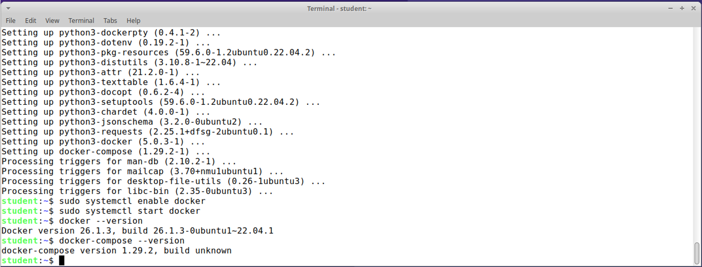

---

## Развертывание DVWA с помощью Docker
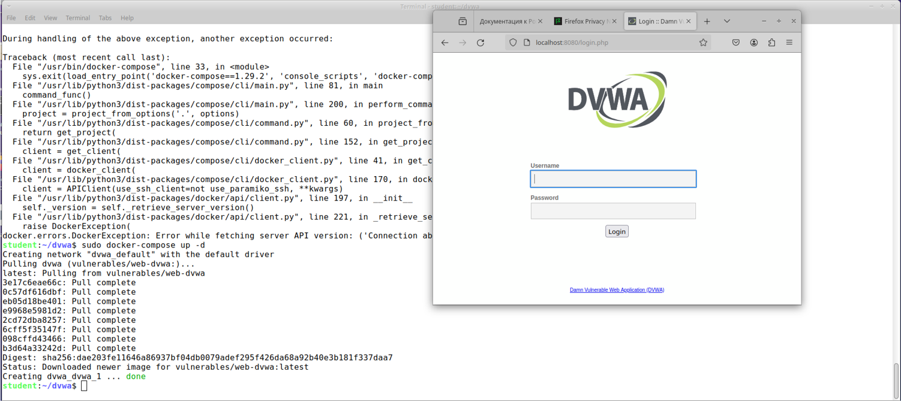  
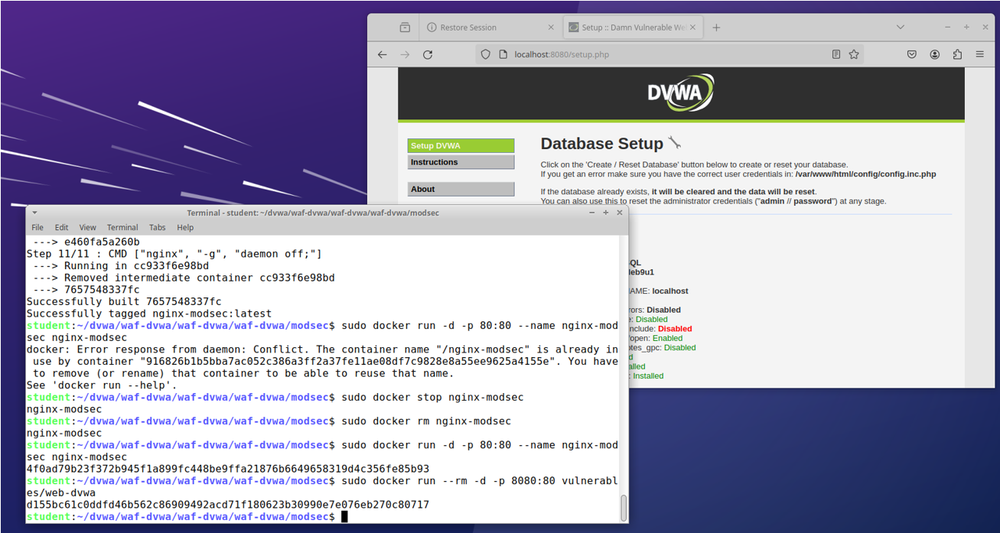

---

## Настройка Web Application Firewall с ModSecurity
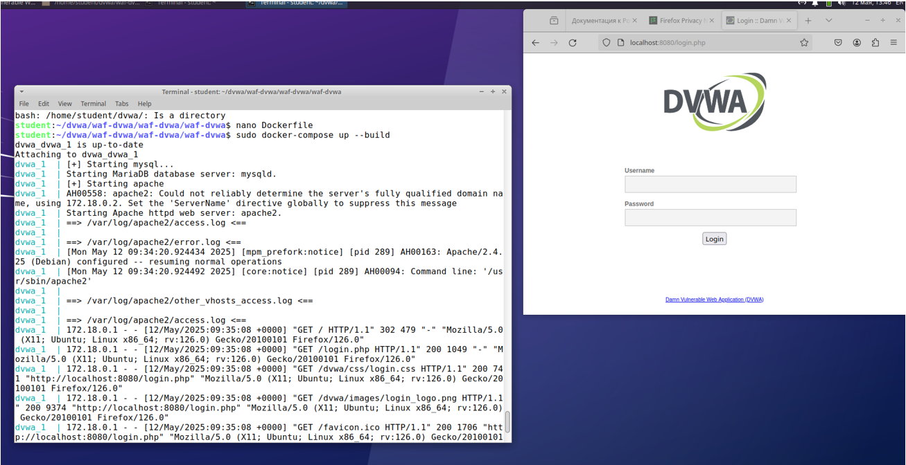

---

## Тестирование защиты

### Проверка XSS
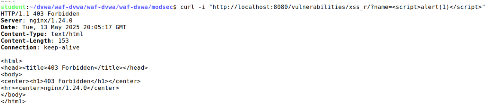

### Проверка SQL-инъекции
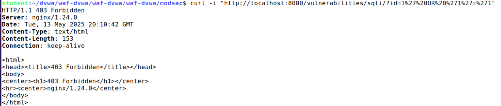

---

## Настройка мониторинга с Kibana и Elastic Stack
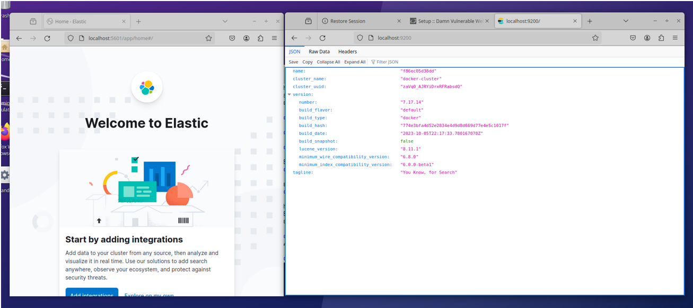  
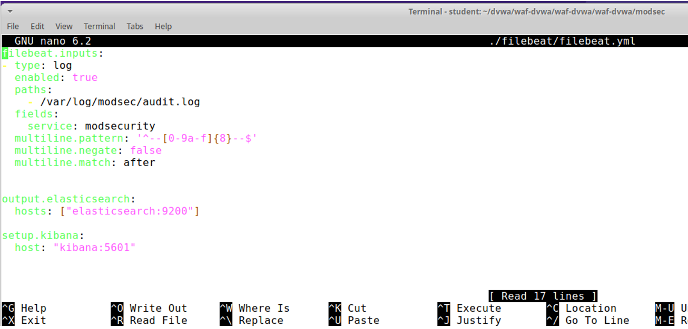  
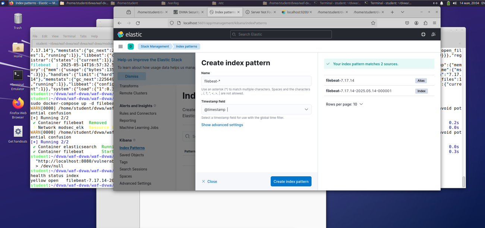  
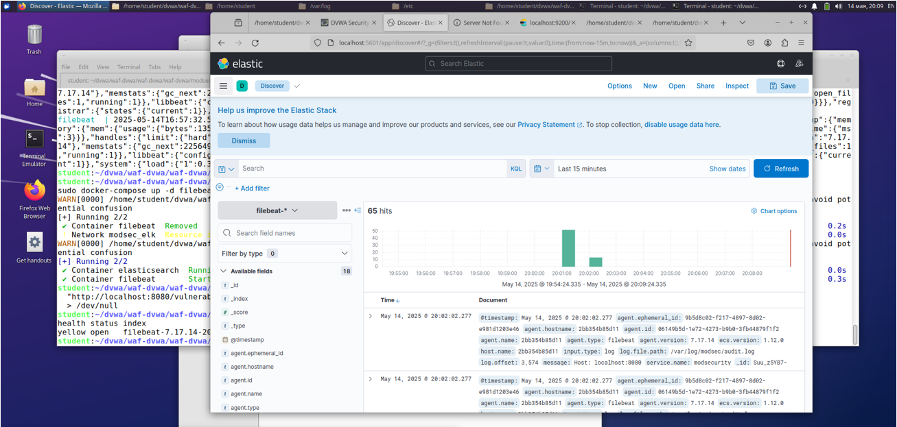  
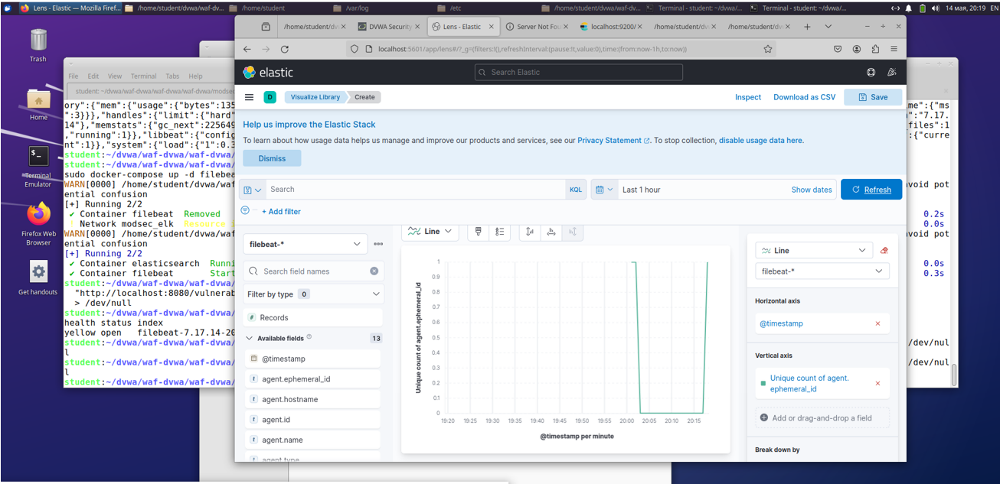

---

## Сравнительное тестирование производительности

### С включенным WAF
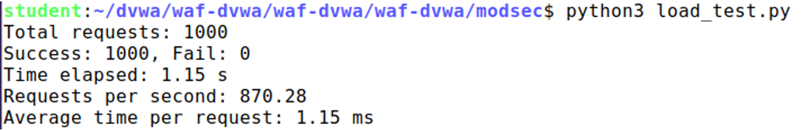

### Без WAF
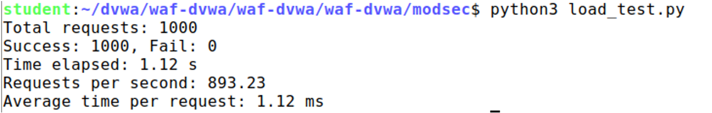

---

## Результаты нагрузочного тестирования
| Параметр               | С WAF       | Без WAF     |
|------------------------|-------------|-------------|
| Запросов в секунду     | 870         | 893         |
| Время обработки (мс)   | 1.15        | 1.12        |

**Вывод:**  
Использование ModSecurity снизило производительность на **~2.5%**, что является незначительным компромиссом для повышения безопасности. Все запросы обрабатывались стабильно в обоих режимах. WAF доказал свою эффективность без существенного влияния на отклик системы.